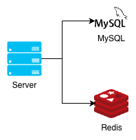

# TODO API 서버
## 1. 개요
인증 기능이 있는 ToDo 목록 관리 하는 API 서버

## 2. EndPoint 목록

| HTTP 메서드 | Path        | 개요                        |
|----------|-------------|---------------------------|
| POST     | `/register` | 신규 사용자 등록                 |
| POST     | `/login`    | 등록 완료된 사용자 정보로 엑세스 토큰을 획득 |
| POST     | `/tasks`    | 엑세스 토큰을 사용해 태스크 등록        |
| GET      | `/tasks`    | 액세스 토큰을 사용해 태스크를 열람       |
| GET      | `/admin`    | 관리자 권한을 가진 사용자만 접속 가능     |

## 3. Beyond the Twelve-Factor App
해당 방침을 따르는 교재를 참고
- [Go 언어로 배우는 웹 어플리케이션 개발](https://jpub.tistory.com/1523)

## 4. Web UI에 대해
Web GUI 화면은 만들지 않거나, AI를 통해 생성할 예정

    html/template 패키지를 통해 구현할 수는 있지만, 사용자 친화적인 웹 UI는 거의 없음
    JS 프레임워크와 비교하면 표현력, CDN 등 웹 전송 기술과의 궁함이 나쁘다.
    사례가 거의 없음

## 5. 시스템 구성
API 서버에서 자주 사용되는 RDBMS와 인메모리 데이터베이스 구성을 기반으로 한 간단한 REST API



##  6. 사용 패키지 선정 방침
1. 표준에 준하도록 선정
2. 프레임워크를 사용하지 않으면서 구현할 예정
3. 이후 각 브랜치 생성 후 프레임워크 도입

## 7. 도커 파일 구성

| 스테이지 명칭        | 역할                              |
|----------------|---------------------------------|
| deploy-builder | 릴리즈용 빌드를 생성하는 스테이지              |
| deploy         | 빌드한 바이너리를 릴리즈하기 위한 컨테이너 생성 스테이지 |
| dev            | 로컬 개발용 컨테이너 생성 스테이지             |

### deploy 스테이지 빌드 실행시
```shell
docker build -t (도커아이디)/gotodo:${DOCKER_TAG} -- target deploy .
```

### docker-compose 실행
```shell
docker compose build --no-cache
```

```shell
docker compose up
```